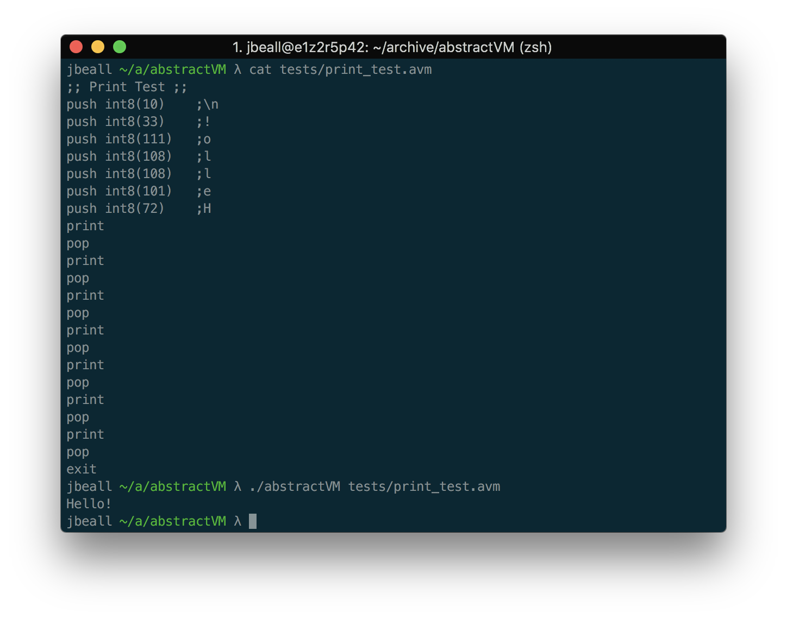

# AbstractVM
This is a very simple stack based VM that supports a small number of asm like simple commands and general mathematical operations.
The machine is stricty typed and performs automatic type promotion. Three integer types of 1, 2, and 4 byte widths are supported,
as well as two floating point types, a 4 byte float and an 8 byte double type.

Input programs are lexed with a simple state machine tokenizer with explicit syntax error output.

## Grammar
Type           | Regular expression
---------------|------------
**Int**        | `(int8\|int16\|int32)((-?[\d]+)))`
**Float**      | `(float\|double)((-?[\d]+.[\d]+)))`
**Operation**  | `(pop\|dump\|add\|sub\|mul\|div\|mod\|print\|exit)(?: *;.*)?`
**Function**   | `(push\|assert\|loop) (\w+(\S+))(?: *;.*)?`
**Termination**| `;([^;]+)`

## Build
`make`

## Usage
`./abstractVM [-d] [input.avm]`

The `-d` flag specifies a debug mode that will output all lexer tokens
If no input file is specified the program will read from stdin and execute when the `;;` symbol is encountered.